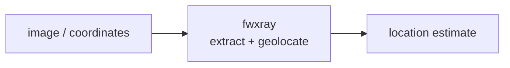

<a name="top"></a>
<div align="center">


# FWXRAY

### Diff two firmware images and surface exactly what changed: new binaries, flipped config flags, added certs, and shifted entropy regions.


[](https://pypi.org/project/cognis-fwxray/) [](https://github.com/cognis-digital/fwxray/actions) [](LICENSE) [](https://github.com/cognis-digital)

*IoT / OT / Embedded — firmware, buses, and device security.*

</div>

```bash
pip install cognis-fwxray
fwxray scan .            # → prioritized findings in seconds
```


## Usage — step by step

1. Install (Python 3.9+):
   ```bash
   pip install fwxray
   ```
2. X-ray two firmware images and print a human-readable changelog of what an
   OTA touched (changed sections, flipped flags, entropy shifts, string deltas):
   ```bash
   fwxray diff old.bin new.bin
   ```
3. Tune entropy-shift sensitivity and the block size for finer/coarser analysis:
   ```bash
   fwxray diff v1.bin v2.bin --block 2048 --entropy-threshold 0.5
   ```
4. Read the output: the report groups changes under Sections / Flags / Entropy
   shifts / Strings. Use `--format json` for machine consumption; the process
   exits `1` when the two images differ (and `0` when byte-for-byte identical).
5. Capture an OTA changelog in CI:
   ```bash
   fwxray diff old.bin new.bin --format json > changelog.json
   ```

## Contents

- [Why fwxray?](#why) · [Features](#features) · [Quick start](#quick-start) · [Example](#example) · [Architecture](#architecture) · [AI stack](#ai-stack) · [How it compares](#how-it-compares) · [Integrations](#integrations) · [Install anywhere](#install-anywhere) · [Related](#related) · [Contributing](#contributing)

<a name="why"></a>
## Why fwxray?

Vendor 'security update' transparency — paste two .bin URLs in CI, get a human-readable changelog of what the OTA actually touched, perfect for viral 'they secretly added telemetry' threads.

`fwxray` is single-purpose, scriptable, and self-hostable: point it at a target, get prioritized results in the format your workflow already speaks (table · JSON · SARIF), gate CI on it, and let agents drive it over MCP.

<div align="right"><a href="#top">↑ back to top</a></div>

<a name="features"></a>
## Features

- ✅ Shannon Entropy
- ✅ Block Entropy Profile
- ✅ Carve Sections
- ✅ Extract Strings
- ✅ Diff Strings
- ✅ Diff Firmware
- ✅ Runs on Linux/macOS/Windows · Docker · devcontainer
- ✅ Ports in Python, JavaScript, Go, and Rust (`ports/`)

<div align="right"><a href="#top">↑ back to top</a></div>

<a name="quick-start"></a>
## Quick start

```bash
pip install cognis-fwxray
fwxray --version
fwxray scan .                       # scan current project
fwxray scan . --format json         # machine-readable
fwxray scan . --fail-on high        # CI gate (non-zero exit)
```

<div align="right"><a href="#top">↑ back to top</a></div>

<a name="example"></a>
## Example

```text
$ fwxray scan .
  [HIGH    ] FWX-001  example finding             (./src/app.py)
  [MEDIUM  ] FWX-002  another signal              (./config.yaml)

  2 findings · risk score 5 · 38ms
```

<div align="right"><a href="#top">↑ back to top</a></div>

<a name="architecture"></a>
## Architecture



<div align="right"><a href="#top">↑ back to top</a></div>

<a name="ai-stack"></a>
## Use it from any AI stack

`fwxray` is interoperable with every popular way of using AI:

- **MCP server** — `fwxray mcp` (Claude Desktop, Cursor, Cognis.Studio, [uncensored-fleet](https://github.com/cognis-digital/uncensored-fleet))
- **OpenAI-compatible / JSON** — pipe `fwxray scan . --format json` into any agent or LLM
- **LangChain · CrewAI · AutoGen · LlamaIndex** — wrap the CLI/JSON as a tool in one line
- **CI / scripts** — exit codes + SARIF for non-AI pipelines

<div align="right"><a href="#top">↑ back to top</a></div>

<a name="how-it-compares"></a>
## How it compares

| | **Cognis fwxray** | binwalk + diffoscope |
|---|:---:|:---:|
| Self-hostable, no account | ✅ | varies |
| Single command, zero config | ✅ | ⚠️ |
| JSON + SARIF for CI | ✅ | varies |
| MCP-native (AI agents) | ✅ | ❌ |
| Polyglot ports (JS/Go/Rust) | ✅ | ❌ |
| Open license | ✅ COCL | varies |

*Built in the spirit of **binwalk + diffoscope**, re-framed the Cognis way. Missing a credit? Open a PR.*

<div align="right"><a href="#top">↑ back to top</a></div>

<a name="integrations"></a>
## Integrations

Pipes into your stack: **SARIF** for code-scanning, **JSON** for anything, an **MCP server** (`fwxray mcp`) for AI agents, and a webhook forwarder for SIEM/Slack/Jira. See [`docs/INTEGRATIONS.md`](docs/INTEGRATIONS.md).

<div align="right"><a href="#top">↑ back to top</a></div>

<a name="install-anywhere"></a>
## Install — every way, every platform

```bash
pip install "git+https://github.com/cognis-digital/fwxray.git"    # pip (works today)
pipx install "git+https://github.com/cognis-digital/fwxray.git"   # isolated CLI
uv tool install "git+https://github.com/cognis-digital/fwxray.git" # uv
pip install cognis-fwxray                                          # PyPI (when published)
docker run --rm ghcr.io/cognis-digital/fwxray:latest --help        # Docker
brew install cognis-digital/tap/fwxray                             # Homebrew tap
curl -fsSL https://raw.githubusercontent.com/cognis-digital/fwxray/main/install.sh | sh
```

| Linux | macOS | Windows | Docker | Cloud |
|---|---|---|---|---|
| `scripts/setup-linux.sh` | `scripts/setup-macos.sh` | `scripts/setup-windows.ps1` | `docker run ghcr.io/cognis-digital/fwxray` | [DEPLOY.md](docs/DEPLOY.md) (AWS/Azure/GCP/k8s) |

<div align="right"><a href="#top">↑ back to top</a></div>

<a name="related"></a>
## Related Cognis tools

- [`canzap`](https://github.com/cognis-digital/canzap) — Replay, fuzz, and assert on CAN bus traffic from a .pcap or SocketCAN interface with a tiny YAML DSL.
- [`sbomb`](https://github.com/cognis-digital/sbomb) — Generate a CycloneDX SBOM directly from an unpacked firmware root filesystem and flag components with known CVEs and EOL kernels.
- [`mqttspy`](https://github.com/cognis-digital/mqttspy) — Passively map an MQTT broker: enumerate topics, detect unauthenticated writes, spot PII/secrets in payloads, and emit a risk report.
- [`uefiscan`](https://github.com/cognis-digital/uefiscan) — Audit UEFI firmware dumps for missing Secure Boot keys, unsigned modules, S3 boot-script vulns, and known SMM threats.
- [`modpot`](https://github.com/cognis-digital/modpot) — Spin up a high-interaction Modbus/DNP3 ICS honeypot that logs attacker register reads/writes as structured JSON.
- [`keyhunt`](https://github.com/cognis-digital/keyhunt) — Scan firmware blobs and filesystem dumps for hardcoded private keys, API tokens, default creds, and weak RSA/ECC material.

**Explore the suite →** [🗂️ all 170+ tools](https://github.com/cognis-digital/cognis-neural-suite) · [⭐ awesome-cognis](https://github.com/cognis-digital/awesome-cognis) · [🔗 cognis-sources](https://github.com/cognis-digital/cognis-sources) · [🤖 uncensored-fleet](https://github.com/cognis-digital/uncensored-fleet) · [🧠 engram](https://github.com/cognis-digital/engram)

<div align="right"><a href="#top">↑ back to top</a></div>

<a name="contributing"></a>
## Contributing

PRs, new rules, and demo scenarios are welcome under the collaboration-pull model — see [CONTRIBUTING.md](CONTRIBUTING.md) and [SECURITY.md](SECURITY.md).

> ### ⭐ If `fwxray` saved you time, **star it** — it genuinely helps others find it.

## Interoperability

`{}` composes with the 300+ tool Cognis suite — JSON in/out and a shared
OpenAI-compatible `/v1` backbone. See **[INTEROP.md](INTEROP.md)** for the
suite map, composition patterns, and reference stacks.

## License

Source-available under the **Cognis Open Collaboration License (COCL) v1.0** — free for personal, internal-evaluation, research, and educational use; **commercial / production use requires a license** (licensing@cognis.digital). See [LICENSE](LICENSE).

---

<div align="center"><sub><b><a href="https://cognis.digital">Cognis Digital</a></b> · one of 170+ tools in the <a href="https://github.com/cognis-digital/cognis-neural-suite">Cognis Neural Suite</a> · <i>Making Tomorrow Better Today</i></sub></div>
